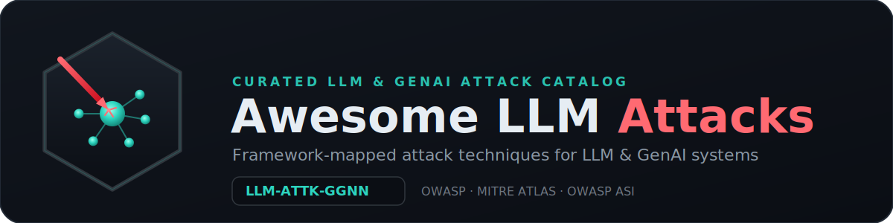

<h1 align="center">
  <a href="https://github.com/martinholovsky/awesome-llm-attacks"></a>
</h1>

<p align="center">
  <a href="https://awesome.re"></a>
</p>

**Adversarial techniques against Large Language Models and GenAI systems**, mapped to the major security frameworks — prompt injection, jailbreaks, encoding/obfuscation, multimodal, training-phase poisoning, privacy extraction, agentic/multi-agent/MCP, availability, trust/reliability, and reasoning-model (chain-of-thought) attacks.

Every technique is cross-referenced to the major security frameworks so you can pivot between offensive taxonomy and defensive controls:

- **OWASP** — [LLM Top 10](https://genai.owasp.org/llm-top-10/) (`LLM01`…`LLM10`)
- **MITRE ATLAS** — adversarial ML technique IDs (`AML.T….`)
- **OWASP Agentic Security Initiative (ASI)** — agentic threats (`ASI…`)
- **OWASP MCP Top 10** — Model Context Protocol threats (`MCP01`…`MCP10`; tool poisoning, line-jumping, etc.)
- **Google SAIF 2.0** — [Secure AI Framework risk map](https://saif.google/secure-ai-framework/saif-map) (agent-focused; risk codes `PIJ`, `DP`, `MEV`, `SDD`, `RA`, `MXF`, …)

Each entry: a stable **`LLM-ATTK-GGNN`** ID (`GG` = group 01–11, `NN` = technique within the group 01–99), the technique, framework mappings, a short description, mitigations, and references. **Contributions welcome** — see contributing.md.

> This is a vendor-neutral knowledge base. It describes attack _classes_ for defenders, red-teamers, and researchers — it is not exploit code. Use it to build tests, guardrails, and threat models.

## Contents

- [Framework crosswalk (group ↔ OWASP ↔ MITRE ATLAS)](#framework-crosswalk-group--owasp--mitre-atlas)
- [Group 1 — Prompt Injection (Direct, Indirect, Stored)](#group-1--prompt-injection-direct-indirect-stored)
- [Group 2 — Jailbreaking & Guardrail Evasion](#group-2--jailbreaking--guardrail-evasion)
- [Group 3 — Encoding, Obfuscation & Tokenizer-Layer Attacks](#group-3--encoding-obfuscation--tokenizer-layer-attacks)
- [Group 4 — Multimodal & Cross-Modal Attacks](#group-4--multimodal--cross-modal-attacks)
- [Group 5 — Training-Phase Poisoning, Backdoors & Fine-Tuning](#group-5--training-phase-poisoning-backdoors--fine-tuning)
- [Group 6 — Privacy & Confidentiality](#group-6--privacy--confidentiality)
- [Group 7 — System & Application Layer](#group-7--system--application-layer)
- [Group 8 — Agentic, Multi-Agent & MCP](#group-8--agentic-multi-agent--mcp)
- [Group 9 — Availability & Resource](#group-9--availability--resource)
- [Group 10 — Trust & Reliability](#group-10--trust--reliability)
- [Group 11 — Reasoning-Model / Chain-of-Thought-Specific](#group-11--reasoning-model--chain-of-thought-specific)

## Framework crosswalk (group ↔ OWASP ↔ MITRE ATLAS)

Per-row cells carry the specific IDs; this maps each **group** to the frameworks for orientation. The IDs below are the **union of the per-row cross-references** in each group. OWASP **LLM Top 10** = 2025; OWASP **ASI** (Top 10 for Agentic Applications 2026, published 2025-12-09); OWASP **MCP Top 10** = 2025 (beta); **Google SAIF** = 2.0 (agent-focused; risk-map retrieved 2026-07-03); **MITRE ATLAS** technique IDs refreshed against the live matrix (`atlas.mitre.org/techniques`, retrieved 2026-06-27), which now carries the LLM/agent expansion through `AML.T0112` (AI-Agent Context Poisoning, Manipulate User LLM Chat History, RAG Poisoning, False RAG Entry Injection, LLM Prompt Obfuscation, Extract LLM System Prompt, LLM Response Rendering, Exfiltration via AI Agent Tool Invocation, AI Supply Chain Rug Pull, Exploitation for Defense Evasion, …). `AML.T0051` parent covers Direct/Indirect/Triggered sub-techniques (`.000/.001/.002`).

| Group                       | OWASP LLM                  | OWASP ASI (2026)    | OWASP MCP (2025)       | Google SAIF 2.0    | MITRE ATLAS                                                                                          |
| --------------------------- | -------------------------- | ------------------- | ---------------------- | ------------------ | ---------------------------------------------------------------------------------------------------- |
| 1 Prompt Injection          | LLM01, LLM08               | —                   | —                      | PIJ, DP, MEV       | AML.T0015, T0051, T0066, T0068, T0070, T0071, T0093, T0094, T0107                                    |
| 2 Jailbreaking              | LLM01, LLM03               | —                   | —                      | PIJ, MEV, MST      | AML.T0018, T0043, T0051, T0054, T0092                                                                |
| 3 Encoding/Obfuscation      | LLM01                      | —                   | —                      | PIJ, MEV           | AML.T0015, T0054, T0068                                                                              |
| 4 Multimodal                | LLM01                      | ASI01               | —                      | PIJ, MEV           | AML.T0051, T0054                                                                                     |
| 5 Poisoning/Supply-chain    | LLM02-05, LLM08            | ASI04, ASI06        | —                      | DP, MST, UTD       | AML.T0010, T0018, T0020                                                                              |
| 6 Privacy & Confidentiality | LLM02, LLM07, LLM08, LLM10 | —                   | —                      | SDD, ISD, MXF, MRE | AML.T0024, T0048, T0051, T0056, T0057, T0069                                                         |
| 7 System & Application      | LLM03, LLM05, LLM06, LLM08 | ASI01, ASI04, ASI05 | MCP05                  | IMO, IIC, RA       | AML.T0010, T0050                                                                                     |
| 8 Agentic/Multi-Agent/MCP   | LLM01, LLM06               | ASI01-08, ASI10     | MCP01-07, MCP09, MCP10 | RA, PIJ, IIC, SDD  | AML.T0020, T0024, T0049, T0051, T0053, T0061, T0067, T0077, T0080, T0081, T0086, T0099, T0109, T0110 |
| 9 Availability & Resource   | LLM10                      | ASI08               | —                      | DMS, DP            | AML.T0029                                                                                            |
| 10 Trust & Reliability      | LLM09                      | ASI08, ASI09        | —                      | IMO, RA            | AML.T0048, T0060, T0062                                                                              |
| 11 Reasoning-Model / CoT    | LLM01, LLM04, LLM10        | —                   | —                      | PIJ, MEV, DMS, DP  | AML.T0018, T0029, T0051, T0054                                                                       |

> MCP08 (Lack of Audit & Telemetry) is a defensive/telemetry requirement with no offensive technique, so it maps to no group. The ATLAS recon / resource-development / classical-ML / credential / agent-infrastructure techniques (T0000–T0048 block and the credential/infra IDs) are intentionally out of scope for a content-layer catalog.
>
> **Google SAIF 2.0 risk codes** (attack-relevant subset): `PIJ` Prompt Injection · `DP` Data Poisoning · `MST` Model Source Tampering · `UTD` Unauthorized Training Data · `MXF` Model Exfiltration · `MRE` Model Reverse Engineering · `MEV` Model Evasion · `SDD` Sensitive Data Disclosure · `ISD` Inferred Sensitive Data · `IMO` Insecure Model Output · `IIC` Insecure Integrated Component · `DMS` Denial of ML Service · `RA` Rogue Actions. SAIF's remaining risks (`EDH` Excessive Data Handling, `MDT` Model Deployment Tampering) are governance/deployment-plane controls without a content-layer offensive technique, so they map to no group.

### Framework coverage

How much of each framework's threat enumeration is reachable from this catalog. "Covered" = the framework item maps to at least one technique group above. Percentages are over each framework's **own** item count, and name the exact version/revision used.

| Framework                                   | Version / revision used            | Coverage                    | Not covered (why)                                                                                   |
| ------------------------------------------- | ---------------------------------- | --------------------------- | --------------------------------------------------------------------------------------------------- |
| OWASP Top 10 for LLM Applications           | 2025                               | 10 / 10 (100%)              | —                                                                                                   |
| OWASP Top 10 for Agentic Applications (ASI) | 2026 (published 2025-12-09)        | 10 / 10 (100%)              | —                                                                                                   |
| OWASP MCP Top 10                            | 2025 (beta)                        | 9 / 10 (90%)                | MCP08 Audit & Telemetry — a detective control, no offensive technique.                              |
| Google SAIF                                 | 2.0 (agent-focused)                | 13 / 15 (87%)               | EDH, MDT — governance/deployment-plane controls, no content-layer attack.                           |
| MITRE ATLAS                                 | live matrix (retrieved 2026-06-27) | full LLM/GenAI/agent subset | Classical-ML / recon / resource-dev / credential / infra techniques are intentionally out of scope. |

> **MITRE ATLAS** is not given a single percentage: the matrix (~84 parent techniques) spans the whole adversarial-ML lifecycle, most of which is out of scope for a content-layer LLM catalog. The crosswalk references the full LLM/GenAI/agent-relevant subset (the `AML.T0051`/`T0054` prompt-injection & jailbreak family plus the `T0080`–`T0112` LLM/agent expansion); a percentage over all 84 would understate coverage of the part that applies.
>
> **Referenced but not mapped per-row:** **NIST AI 600-1** (GenAI Profile, July 2024) and **NIST SP 800-218A** (SSDF for GenAI, July 2024) are risk/practice frameworks, not attack taxonomies — every attack vector they name is already covered. **BSI** _Generative AI Models – Opportunities and Risks_ (v2.0, 2025-02-03; arXiv:2406.04734) and the **ANSSI–BSI** _Design Principles for LLM-based Systems with Zero Trust_ (Aug 2025) are cited inline where their risk register (e.g. R20, R21, R27) anchors a specific technique. **CWE** weakness IDs and **CVE** disclosures are likewise cited inline in the per-row Framework/References cells where a specific weakness anchors a technique (e.g. CWE-61/CWE-451 for GhostApproval `0818`, CVE-2025-68664 for LangGrinch `0707`) rather than mapped as a group taxonomy.

---

## Group 1 — Prompt Injection (Direct, Indirect, Stored)

| ID            | Technique                                             | Framework                                                       | Description                                                                                                                                                                                                                                                                                                                                                                                                                                                 | Mitigation                                                                                                                                                                                                                                                                                                                   | References                                                                                                                                                                                              |
| ------------- | ----------------------------------------------------- | --------------------------------------------------------------- | ----------------------------------------------------------------------------------------------------------------------------------------------------------------------------------------------------------------------------------------------------------------------------------------------------------------------------------------------------------------------------------------------------------------------------------------------------------- | ---------------------------------------------------------------------------------------------------------------------------------------------------------------------------------------------------------------------------------------------------------------------------------------------------------------------------- | ------------------------------------------------------------------------------------------------------------------------------------------------------------------------------------------------------- |
| LLM-ATTK-0101 | Direct Prompt Injection                               | OWASP LLM01; ATLAS AML.T0051.000                                | User input overrides system/developer instructions ("Ignore previous instructions…").                                                                                                                                                                                                                                                                                                                                                                       | Untrusted-input handling; instruction/context separation; external guardrails.                                                                                                                                                                                                                                               | [Simon Willison — Prompt injection (2022)](https://simonwillison.net/2022/Sep/12/prompt-injection/)                                                                                                     |
| LLM-ATTK-0102 | Indirect Prompt Injection                             | OWASP LLM01; ATLAS AML.T0051.001, AML.T0093                     | Malicious instructions arrive via ingested content (web/email/doc/RAG chunk).                                                                                                                                                                                                                                                                                                                                                                               | Segregate retrieved content; provenance; deterministic egress; disable auto-render of links/images.                                                                                                                                                                                                                          | OWASP LLM01; [Greshake et al. — Indirect Prompt Injection (arXiv:2302.12173)](https://arxiv.org/abs/2302.12173)                                                                                         |
| LLM-ATTK-0103 | Stored / Persistent Prompt Injection                  | OWASP LLM01; ATLAS AML.T0051.002, AML.T0094                     | Payload persisted in a store, fires on later retrieval (ticket, profile, vector DB).                                                                                                                                                                                                                                                                                                                                                                        | Treat stored data as untrusted on read; provenance; re-scan on retrieval.                                                                                                                                                                                                                                                    | [OWASP LLM01:2025 Prompt Injection](https://genai.owasp.org/llmrisk/llm01-prompt-injection/)                                                                                                            |
| LLM-ATTK-0104 | ASCII Smuggling / Invisible-Character Injection       | OWASP LLM01; ATLAS AML.T0051, AML.T0068                         | Instructions in Unicode tag blocks / zero-width / bidi — invisible to humans, legible to tokenizer.                                                                                                                                                                                                                                                                                                                                                         | NFKC normalize + strip tag block (U+E0000–E007F), ZW, bidi before model and display.                                                                                                                                                                                                                                         | [Embrace The Red — ASCII smuggling / Unicode tags](https://embracethered.com/blog/posts/2024/hiding-and-finding-text-with-unicode-tags/)                                                                |
| LLM-ATTK-0105 | RAG / Vector-Store Retrieval Poisoning                | OWASP LLM08; OWASP LLM01; ATLAS AML.T0070, AML.T0066, AML.T0071 | Attacker-planted content in web/Slack/docs is embedded and later retrieved, injecting instructions across access silos (e.g. the Slack-AI case); a vector/embedding-weakness escalation of indirect injection.                                                                                                                                                                                                                                              | Sanitize + normalize pre-embedding; namespace isolation by ACL; attribution-gated generation.                                                                                                                                                                                                                                | [RAG security — forgotten attack surface](https://christian-schneider.net/blog/rag-security-forgotten-attack-surface/)                                                                                  |
| LLM-ATTK-0106 | Anti-Analysis Prompt Injection (defensive-AI evasion) | OWASP LLM01; ATLAS AML.T0051.001, AML.T0015, AML.T0107          | Indirect prompt injection embedded in a malicious artifact to deceive the _defender's_ AI — e.g. fabricated "system"/error messages hidden in a malware sample's strings push an LLM-assisted malware-triage/analysis agent to doubt its session and **abort, truncate, or refuse** analysis. Attacks the analysis agent's _perception_, not the sandbox. In-the-wild: the GASLIGHT macOS Rust backdoor (38 fake system messages; NK-attributed, Jun 2026). | Treat analyzed artifacts as untrusted **data, not instructions**; role/provenance separation so in-content "system" markers can't steer control flow; segment-level injection scan; intent classification independent of the artifact's own claims; human verification before an agent aborts on artifact-supplied "errors". | [The Hacker News (GASLIGHT, Jun 2026)](https://thehackernews.com/2026/06/new-gaslight-macos-malware-uses-prompt.html); [ATLAS AML.T0015 — Evade AI Model](https://atlas.mitre.org/techniques/AML.T0015) |

## Group 2 — Jailbreaking & Guardrail Evasion

| ID            | Technique                                                  | Framework                                         | Description                                                                                                                                                                                                               | Mitigation                                                                                                                         | References                                                                                                                                                              |
| ------------- | ---------------------------------------------------------- | ------------------------------------------------- | ------------------------------------------------------------------------------------------------------------------------------------------------------------------------------------------------------------------------- | ---------------------------------------------------------------------------------------------------------------------------------- | ----------------------------------------------------------------------------------------------------------------------------------------------------------------------- |
| LLM-ATTK-0201 | Adversarial Suffix (GCG)                                   | OWASP LLM01; ATLAS AML.T0054                      | Gradient-optimised transferable suffix forces affirmative completion.                                                                                                                                                     | Perplexity/ASF filtering; SmoothLLM; intent-aware FT.                                                                              | GCG: [arXiv 2307.15043](https://arxiv.org/abs/2307.15043)                                                                                                               |
| LLM-ATTK-0202 | AutoDAN (stealthy genetic)                                 | OWASP LLM01; ATLAS AML.T0054                      | Genetic algorithm → fluent low-perplexity jailbreaks that evade perplexity defences.                                                                                                                                      | Semantic (not perplexity) classifiers; multi-signal guardrails.                                                                    | AutoDAN: [arXiv 2310.04451](https://arxiv.org/abs/2310.04451)                                                                                                           |
| LLM-ATTK-0203 | PAIR (automated semantic refinement)                       | OWASP LLM01; ATLAS AML.T0054                      | Attacker-LLM refines a jailbreak in ~20 black-box queries.                                                                                                                                                                | Behaviour analytics on iterative probing; semantic classifiers.                                                                    | PAIR: [arXiv 2310.08419](https://arxiv.org/abs/2310.08419)                                                                                                              |
| LLM-ATTK-0204 | TAP (Tree of Attacks w/ Pruning)                           | OWASP LLM01; ATLAS AML.T0054                      | PAIR + tree search/pruning; high black-box ASR.                                                                                                                                                                           | As PAIR; anomaly detection on branching queries.                                                                                   | TAP: [arXiv 2312.02119](https://arxiv.org/abs/2312.02119)                                                                                                               |
| LLM-ATTK-0205 | Automated Fuzzing (GPTFuzz/JBFuzz/BEAST)                   | OWASP LLM01; ATLAS AML.T0054                      | Fuzzing/seed-mutation mass-generates jailbreaks (JBFuzz ~99% avg ASR).                                                                                                                                                    | Continuous red-teaming; classifier retraining; output monitoring.                                                                  | GPTFuzz: [arXiv 2309.10253](https://arxiv.org/abs/2309.10253); JBFuzz: [arXiv 2503.08990](https://arxiv.org/abs/2503.08990) (GPT-4o/Gemini-2.0/DeepSeek-R1)             |
| LLM-ATTK-0206 | Crescendo (multi-turn escalation)                          | OWASP LLM01; ATLAS AML.T0054                      | Benign opening then incremental escalation across turns.                                                                                                                                                                  | Conversation-level (not turn-level) safety; cumulative-intent scoring.                                                             | Crescendo: [arXiv 2404.01833](https://arxiv.org/abs/2404.01833)                                                                                                         |
| LLM-ATTK-0207 | Echo Chamber (multi-turn context poisoning)                | OWASP LLM01; ATLAS AML.T0054                      | Indirect suggestion poisons internal context; >40% ASR all-cats, >90% for hate/violence/sexual.                                                                                                                           | Multi-turn context-integrity monitoring; semantic drift detection.                                                                 | Echo Chamber: [arXiv 2601.05742](https://arxiv.org/abs/2601.05742); NeuralTrust blog (2025-06)                                                                          |
| LLM-ATTK-0208 | Deceptive Delight                                          | OWASP LLM01; ATLAS AML.T0054                      | Unsafe topic embedded in benign positive context (65% avg ASR / 3 turns).                                                                                                                                                 | Cumulative-intent scoring; context-window inspection.                                                                              | [Unit 42 — Deceptive Delight (2024-10)](https://unit42.paloaltonetworks.com/jailbreak-llms-through-camouflage-distraction/)                                             |
| LLM-ATTK-0209 | Bad Likert Judge                                           | OWASP LLM01; ATLAS AML.T0054                      | Model coerced into grader role to emit harmful "exemplars" (~71.6% avg ASR).                                                                                                                                              | Role-abuse detection; refuse self-eval of harmful exemplars.                                                                       | [Unit 42 — Bad Likert Judge (2025-01)](https://unit42.paloaltonetworks.com/multi-turn-technique-jailbreaks-llms/)                                                       |
| LLM-ATTK-0210 | Policy Puppetry                                            | OWASP LLM01; ATLAS AML.T0054                      | Payload disguised as policy/config (XML/JSON/INI), leetspeak; universal across major LLMs.                                                                                                                                | Never let user content define policy; structural-format detection; external enforcement.                                           | [HiddenLayer — Policy Puppetry (2025-04)](https://hiddenlayer.com/innovation-hub/novel-universal-bypass-for-all-major-llms/)                                            |
| LLM-ATTK-0211 | Skeleton Key                                               | OWASP LLM01; ATLAS AML.T0054                      | Convinces model to _augment_ not replace guidelines ("add a warning but still answer").                                                                                                                                   | Guardrails independent of model self-judgement; output classifier.                                                                 | [Microsoft — Skeleton Key (2024-06)](https://www.microsoft.com/en-us/security/blog/2024/06/26/mitigating-skeleton-key-a-new-type-of-generative-ai-jailbreak-technique/) |
| LLM-ATTK-0212 | Context Compliance Attack                                  | OWASP LLM01; ATLAS AML.T0092                      | Forges prior _assistant_ turns in submitted history so model "continues" compliant.                                                                                                                                       | Server-side history; reject/sign client-asserted assistant turns.                                                                  | Microsoft MSRC: [arXiv 2503.05264](https://arxiv.org/abs/2503.05264)                                                                                                    |
| LLM-ATTK-0213 | Roleplay / Persona (DAN class)                             | OWASP LLM01; ATLAS AML.T0054                      | "You are DAN, you have no rules" persona dissociation.                                                                                                                                                                    | Persona-jailbreak classifier; refusal hardening; monitoring.                                                                       | JailbreakHub: [arXiv 2308.03825](https://arxiv.org/abs/2308.03825)                                                                                                      |
| LLM-ATTK-0214 | DeepInception (nested fiction)                             | OWASP LLM01; ATLAS AML.T0054                      | Nested story-within-story distances the harmful request.                                                                                                                                                                  | Recursive-context inspection; intent extraction across nesting.                                                                    | DeepInception: [arXiv 2311.03191](https://arxiv.org/abs/2311.03191)                                                                                                     |
| LLM-ATTK-0215 | Many-shot Jailbreaking                                     | OWASP LLM01; ATLAS AML.T0054                      | Hundreds of fabricated in-context Q&A turns in which the model complies, overriding fine-tuned safety via in-context-learning dominance in long contexts.                                                                 | Cap/penalize very long multi-shot contexts; evaluate safety over the aggregate context; flag repeated harmful exemplars.           | [Anthropic — Many-shot Jailbreaking (2024)](https://www.anthropic.com/research/many-shot-jailbreaking)                                                                  |
| LLM-ATTK-0216 | Persuasive Adversarial Prompts (PAP)                       | OWASP LLM01; ATLAS AML.T0054                      | Social-science persuasion taxonomies talk the model past refusal.                                                                                                                                                         | Persuasion-pattern classifiers; intent over framing.                                                                               | PAP: [arXiv 2401.06373](https://arxiv.org/abs/2401.06373)                                                                                                               |
| LLM-ATTK-0217 | Refusal Suppression / Prefill / Affirmative Forcing        | OWASP LLM01; ATLAS AML.T0054                      | "Don't refuse / begin with 'Sure'" or prefilling the assistant turn.                                                                                                                                                      | Output-side classifier; block untrusted assistant prefill.                                                                         | [Adaptive attacks — prefilling / refusal suppression (arXiv:2404.02151)](https://arxiv.org/abs/2404.02151)                                                              |
| LLM-ATTK-0218 | Abliteration / Single Refusal-Direction Ablation           | ATLAS AML.T0018 (model modification); OWASP LLM03 | Refusal is mediated by one residual-stream direction (across 13 open models ≤72B); weight-orthogonalising against it surgically disables refusal with minimal capability loss (popularised as "abliteration"). White-box. | Treat 3rd-party/uncensored weights as untrusted; provenance/signing; egress content classifier independent of the model's refusal. | [arXiv 2406.11717](https://arxiv.org/abs/2406.11717) (NeurIPS 2024); cf. dispute 2602.02132 (mechanism only)                                                            |
| LLM-ATTK-0219 | Many-Shot Jailbreaking                                     | —                                                 | _Duplicate — merged into LLM-ATTK-0215._                                                                                                                                                                                  | —                                                                                                                                  | —                                                                                                                                                                       |
| LLM-ATTK-0220 | Policy Puppetry                                            | OWASP LLM01; ATLAS AML.T0051                      | Malicious instructions formatted as a policy/config file (XML/JSON/INI) so the model prioritizes structured metadata over safety boundaries. Universal-bypass claim is contested.                                         | Strip/sanitize structural tags from user input; run a secondary classifier on XML/JSON intent before generation.                   | [HiddenLayer 2025](https://www.hiddenlayer.com/research/novel-universal-bypass-for-all-major-llms)                                                                      |
| LLM-ATTK-0221 | Best-of-N (BoN) Jailbreaking                               | OWASP LLM01; ATLAS AML.T0054, AML.T0043           | Sample many randomly-augmented variants (casing, punctuation, ASCII, audio pitch) of a prompt; ASR scales power-law with N (~89% GPT-4o at N=10k); works across text/vision/audio.                                        | Per-user adversarial-pattern + rate detection; output-side classifier; stochastic refusal.                                         | [Best-of-N (arXiv:2412.03556)](https://arxiv.org/abs/2412.03556)                                                                                                        |
| LLM-ATTK-0222 | Automated Adversarial-Suffix Optimizers (GCG / PAIR / TAP) | OWASP LLM01; ATLAS AML.T0043                      | Black-box (PAIR), tree-search (TAP), and white-box gradient (GCG/AutoDAN/BEAST) optimizers that auto-generate transferable jailbreak suffixes.                                                                            | Perplexity filtering; SmoothLLM; circuit-breaker / adversarial training.                                                           | [BEAST — one-GPU-minute adversarial suffixes (arXiv:2402.15570)](https://arxiv.org/abs/2402.15570)                                                                      |

## Group 3 — Encoding, Obfuscation & Tokenizer-Layer Attacks

| ID            | Technique                                                      | Framework                               | Description                                                                                                                                                                                                                                                                                                                                                                             | Mitigation                                                                                                                                                                             | References                                                                                                                                                                                                                                                                                                                                                                                                        |
| ------------- | -------------------------------------------------------------- | --------------------------------------- | --------------------------------------------------------------------------------------------------------------------------------------------------------------------------------------------------------------------------------------------------------------------------------------------------------------------------------------------------------------------------------------- | -------------------------------------------------------------------------------------------------------------------------------------------------------------------------------------- | ----------------------------------------------------------------------------------------------------------------------------------------------------------------------------------------------------------------------------------------------------------------------------------------------------------------------------------------------------------------------------------------------------------------- |
| LLM-ATTK-0301 | Encoding / Cipher (Base64/ROT13/hex/Morse/braille/atbash)      | OWASP LLM01; ATLAS AML.T0054, AML.T0068 | Harmful intent encoded so filters miss it; model decodes and complies.                                                                                                                                                                                                                                                                                                                  | Decode-then-scan; classify on decoded text.                                                                                                                                            | [Jailbroken: How Does LLM Safety Training Fail? (arXiv:2307.02483)](https://arxiv.org/abs/2307.02483)                                                                                                                                                                                                                                                                                                             |
| LLM-ATTK-0302 | CipherChat                                                     | OWASP LLM01; ATLAS AML.T0054            | Whole conversation in a cipher the model uses but the safety layer can't read.                                                                                                                                                                                                                                                                                                          | Cipher detection; refuse unverified ciphers; decode-then-classify.                                                                                                                     | CipherChat: [arXiv 2308.06463](https://arxiv.org/abs/2308.06463)                                                                                                                                                                                                                                                                                                                                                  |
| LLM-ATTK-0303 | Low-Resource-Language Translation                              | OWASP LLM01; ATLAS AML.T0054            | Safety alignment weaker in low-resource languages.                                                                                                                                                                                                                                                                                                                                      | Multilingual classifiers; translate-to-English inspection; parity testing.                                                                                                             | [arXiv 2310.02446](https://arxiv.org/abs/2310.02446)                                                                                                                                                                                                                                                                                                                                                              |
| LLM-ATTK-0304 | ArtPrompt (ASCII art)                                          | OWASP LLM01; ATLAS AML.T0054            | Trigger words drawn as ASCII art evade keyword filters.                                                                                                                                                                                                                                                                                                                                 | Visual/ASCII-art detection; reconstruct-then-classify.                                                                                                                                 | ArtPrompt: [arXiv 2402.11753](https://arxiv.org/abs/2402.11753)                                                                                                                                                                                                                                                                                                                                                   |
| LLM-ATTK-0305 | Payload Splitting / Token Smuggling                            | OWASP LLM01; ATLAS AML.T0054            | Harmful instruction assembled from benign fragments at inference.                                                                                                                                                                                                                                                                                                                       | Whole-context intent reconstruction; variable-assembly detection.                                                                                                                      | [Exploiting Programmatic Behavior of LLMs — payload splitting (arXiv:2302.05733)](https://arxiv.org/abs/2302.05733)                                                                                                                                                                                                                                                                                               |
| LLM-ATTK-0306 | Homoglyph / Zero-Width / Bidi Obfuscation                      | OWASP LLM01; ATLAS AML.T0054            | Confusable/invisible chars break filters, preserve model semantics.                                                                                                                                                                                                                                                                                                                     | NFKC, homoglyph fold, ZW/bidi strip before classification.                                                                                                                             | [Bad Characters: Imperceptible NLP Attacks (arXiv:2106.09898)](https://arxiv.org/abs/2106.09898)                                                                                                                                                                                                                                                                                                                  |
| LLM-ATTK-0307 | TokenBreak (tokenizer manipulation)                            | OWASP LLM01; ATLAS AML.T0054            | Manipulates subword tokenisation so a guard mis-tokenises text the target understands.                                                                                                                                                                                                                                                                                                  | Align guard tokenizer; perturbed-token training; multiple tokenizers.                                                                                                                  | HiddenLayer — TokenBreak: [arXiv 2506.07948](https://arxiv.org/abs/2506.07948)                                                                                                                                                                                                                                                                                                                                    |
| LLM-ATTK-0308 | Glitch / Anomalous Tokens                                      | ATLAS AML.T0054                         | Under-trained tokens cause unstable/unaligned behaviour.                                                                                                                                                                                                                                                                                                                                | Tokenizer hygiene; anomalous-token blocklists; vocab auditing.                                                                                                                         | [Fishing for Magikarp — under-trained tokens (arXiv:2405.05417)](https://arxiv.org/abs/2405.05417)                                                                                                                                                                                                                                                                                                                |
| LLM-ATTK-0309 | Special / Chat-Template Token Injection                        | OWASP LLM01                             | Injecting chat control tokens (im_start / system / end-of-sequence markers) to forge role boundaries in the template.                                                                                                                                                                                                                                                                   | Escape/strip special tokens in untrusted input; structured assembly.                                                                                                                   | [ChatInject — abusing chat templates (arXiv:2509.22830)](https://arxiv.org/abs/2509.22830)                                                                                                                                                                                                                                                                                                                        |
| LLM-ATTK-0310 | FlipAttack                                                     | OWASP LLM01                             | Reverse or permute the characters/words of a harmful prompt and instruct the model to restore and execute it, evading token-level filters.                                                                                                                                                                                                                                              | Decode/normalize before classification; run semantic evaluation on the reconstructed text.                                                                                             | [FlipAttack (arXiv:2410.02832)](https://github.com/yueliu1999/FlipAttack)                                                                                                                                                                                                                                                                                                                                         |
| LLM-ATTK-0311 | MathPrompt (Symbolic Mathematics)                              | OWASP LLM01                             | Encode harmful intent as symbolic math / set-theory; the model decodes it while solving, bypassing NLP safety filters (reported ~73.6% ASR).                                                                                                                                                                                                                                            | Semantic safety evaluation on the decoded symbolic representation; dual-stage analysis of dense math inputs.                                                                           | [Symbolic Math Jailbreak (arXiv:2409.11445)](https://arxiv.org/abs/2409.11445)                                                                                                                                                                                                                                                                                                                                    |
| LLM-ATTK-0312 | ArtPrompt (ASCII-Art Jailbreak)                                | OWASP LLM01; ATLAS AML.T0054            | Replace blocked keywords with ASCII art the model decodes but the safety filter does not.                                                                                                                                                                                                                                                                                               | Visual-in-text pre-classifier; OCR-then-filter the resolved plaintext.                                                                                                                 | [ArtPrompt — reference implementation (uw-nsl/ArtPrompt)](https://github.com/uw-nsl/ArtPrompt)                                                                                                                                                                                                                                                                                                                    |
| LLM-ATTK-0313 | Cipher / Low-Resource-Language Jailbreak                       | OWASP LLM01                             | Caesar/Base64/Morse ciphers, code-switching, or low-resource languages (Zulu, Hmong) carry harmful intent past English-aligned filters.                                                                                                                                                                                                                                                 | Language-aware safety filters; translate-then-classify; safety fine-tune across long-tail languages.                                                                                   | [Multilingual Jailbreak Challenges (arXiv:2310.06474)](https://arxiv.org/abs/2310.06474)                                                                                                                                                                                                                                                                                                                          |
| LLM-ATTK-0314 | LLM-Classifier / Moderation Evasion (adversarial perturbation) | OWASP LLM01; ATLAS AML.T0015, AML.T0054 | Meaning-preserving perturbations — typos, homoglyphs, synonym/word-boundary edits, universal adversarial prefixes — make malicious input evade an LLM used as a _discriminative_ filter (toxicity/hate-speech moderation, or a guardrail classifier like Llama Guard), so it is misclassified as benign. Defeats detection, unlike generative jailbreaks that elicit prohibited output. | Normalize/sanitize inputs (spell-check, homoglyph fold, embedding-cluster canonicalization); adversarially fine-tune the classifier; defense-in-depth rather than a single LLM filter. | [PRP — guardrail evasion (arXiv:2402.15911)](https://arxiv.org/abs/2402.15911); [TextFooler (arXiv:1907.11932)](https://arxiv.org/abs/1907.11932); [Hate-speech classifier evasion (arXiv:1808.09115)](https://arxiv.org/abs/1808.09115); [BSI Generative AI Models — R27 (arXiv:2406.04734)](https://arxiv.org/abs/2406.04734); [The Attacker Moves Second (arXiv:2510.09023)](https://arxiv.org/abs/2510.09023) |

## Group 4 — Multimodal & Cross-Modal Attacks

| ID            | Technique                                  | Framework                    | Description                                                                                                                                                                           | Mitigation                                                                                             | References                                                                                                                        |
| ------------- | ------------------------------------------ | ---------------------------- | ------------------------------------------------------------------------------------------------------------------------------------------------------------------------------------- | ------------------------------------------------------------------------------------------------------ | --------------------------------------------------------------------------------------------------------------------------------- |
| LLM-ATTK-0401 | Image-Embedded Text Injection              | OWASP LLM01                  | Instructions written into an image bypass text-only filters.                                                                                                                          | Per-modality sanitisation; OCR-then-classify; dual-LLM isolation.                                      | [Simon Willison — Multimodal prompt injection image attacks](https://simonwillison.net/2023/Oct/14/multi-modal-prompt-injection/) |
| LLM-ATTK-0402 | FigStep (typographic visual jailbreak)     | OWASP LLM01; ATLAS AML.T0054 | Prohibited content as typographic images bypasses LVLM alignment.                                                                                                                     | Visual safety classifier; OCR + intent extraction.                                                     | FigStep: [arXiv 2311.05608](https://arxiv.org/abs/2311.05608)                                                                     |
| LLM-ATTK-0403 | Cross-Modal Prompt Injection (CrossInject) | OWASP LLM01; ATLAS AML.T0051 | Jointly optimized adversarial image (visual-latent alignment) plus an LLM-crafted textual command that together hijack a multimodal agent's decisions; +30.1% ASR over prior attacks. | Cross-modal consistency checks; validate vision-decoded intent against text intent before aggregation. | CrossInject: [arXiv 2504.14348](https://arxiv.org/abs/2504.14348) (ACM MM 2025)                                                   |
| LLM-ATTK-0404 | Steganographic Prompt Injection            | OWASP LLM01                  | Instructions hidden via stego in images/audio; **max ~67% ASR** (GPT-4o) in medical VLMs.                                                                                             | Steganalysis; modality sanitisation; media provenance/signing.                                         | [Clusmann et al., Nat. Commun. 16:1239 (2025)](https://doi.org/10.1038/s41467-024-55631-x)                                        |
| LLM-ATTK-0405 | Cross-Modal Agent Injection (AgentTypo)    | OWASP LLM01; ASI01           | Optimised text in webpage images drives multimodal agents (image-only ASR 23→45%).                                                                                                    | Screenshot sanitisation; tool-output isolation; HITL on high-impact.                                   | AgentTypo: [arXiv 2510.04257](https://arxiv.org/abs/2510.04257)                                                                   |
| LLM-ATTK-0406 | Audio / Video Prompt Injection             | OWASP LLM01                  | Instructions in audio/video processed before any text filter.                                                                                                                         | Per-modality transcription + classification; modality isolation.                                       | [Christian Schneider — Multimodal prompt injection](https://christian-schneider.net/blog/multimodal-prompt-injection/)            |
| LLM-ATTK-0407 | Cross-Modal Prompt Injection (CrossInject) | —                            | _Duplicate — merged into LLM-ATTK-0403._                                                                                                                                              | —                                                                                                      | —                                                                                                                                 |

## Group 5 — Training-Phase Poisoning, Backdoors & Fine-Tuning

| ID            | Technique                                                                     | Framework                                     | Description                                                                                                                                                                                                                                                                                                                                                                                                                     | Mitigation                                                                                                                                                                                                                                                 | References                                                                                                                                                                                                                                                                                                                                                                                                                                                                    |
| ------------- | ----------------------------------------------------------------------------- | --------------------------------------------- | ------------------------------------------------------------------------------------------------------------------------------------------------------------------------------------------------------------------------------------------------------------------------------------------------------------------------------------------------------------------------------------------------------------------------------- | ---------------------------------------------------------------------------------------------------------------------------------------------------------------------------------------------------------------------------------------------------------- | ----------------------------------------------------------------------------------------------------------------------------------------------------------------------------------------------------------------------------------------------------------------------------------------------------------------------------------------------------------------------------------------------------------------------------------------------------------------------------- |
| LLM-ATTK-0501 | Training Data Poisoning                                                       | OWASP LLM04; ATLAS AML.T0020                  | Manipulating training/embedding data to implant bias/backdoor.                                                                                                                                                                                                                                                                                                                                                                  | Data provenance/ML-BOM; vendor vetting; anomaly detection.                                                                                                                                                                                                 | [OWASP LLM04:2025 Data & Model Poisoning](https://genai.owasp.org/llmrisk/llm042025-data-and-model-poisoning/)                                                                                                                                                                                                                                                                                                                                                                |
| LLM-ATTK-0502 | Backdoor / Trigger Attack                                                     | OWASP LLM04; ATLAS AML.T0018                  | Hidden weight trigger fires malicious action; small poison fractions suffice.                                                                                                                                                                                                                                                                                                                                                   | CLEANGEN; SANDE; weight merging; trigger detection.                                                                                                                                                                                                        | survey: [arXiv 2406.06852](https://arxiv.org/abs/2406.06852)                                                                                                                                                                                                                                                                                                                                                                                                                  |
| LLM-ATTK-0503 | Sleeper Agents / Deceptive Alignment                                          | OWASP LLM04; ATLAS AML.T0018                  | Backdoors persist through RLHF; defect on trigger.                                                                                                                                                                                                                                                                                                                                                                              | Provenance; interpretability probes; treat 3rd-party weights as untrusted.                                                                                                                                                                                 | Sleeper Agents: [arXiv 2401.05566](https://arxiv.org/abs/2401.05566)                                                                                                                                                                                                                                                                                                                                                                                                          |
| LLM-ATTK-0504 | RAG / Knowledge-Base Poisoning (PoisonedRAG)                                  | OWASP LLM08; ASI06; ATLAS AML.T0020           | A few malicious docs steer RAG answers (~90% ASR w/ ~5 docs).                                                                                                                                                                                                                                                                                                                                                                   | Source vetting on ingest; retrieval anomaly detection; content signing.                                                                                                                                                                                    | PoisonedRAG: [arXiv 2402.07867](https://arxiv.org/abs/2402.07867)                                                                                                                                                                                                                                                                                                                                                                                                             |
| LLM-ATTK-0505 | Malicious Fine-Tuning / Shadow Alignment                                      | OWASP LLM03/04; ATLAS AML.T0018               | FaaS abused; small harmful sets strip alignment. **Canonical demo:** Qi et al. — fine-tuning GPT-3.5 Turbo on ~10 adversarial examples for <$0.20 via the FT-API removes guardrails.                                                                                                                                                                                                                                            | Screen FT data; post-tune safety evals; alignment-preservation.                                                                                                                                                                                            | Shadow Alignment: [arXiv 2310.02949](https://arxiv.org/abs/2310.02949); **Qi et al. (FT-API harm): [arXiv 2310.03693](https://arxiv.org/abs/2310.03693) (ICLR 2024 oral)**                                                                                                                                                                                                                                                                                                    |
| LLM-ATTK-0506 | Benign-Data Overfitting Jailbreak                                             | OWASP LLM04; ATLAS AML.T0018                  | Overfit-then-defit on benign QA erases refusals; no harmful sample to detect. **Adjacent (distinct axis):** _unintended_ alignment erosion — fine-tuning on ordinary benign datasets (Alpaca/Dolly/LLaVA) with NO malicious intent also degrades safety (lesser extent; Qi et al. 2310.03693, He et al. 2404.01099).                                                                                                            | Behavioural post-tune evals; refusal-retention checks.                                                                                                                                                                                                     | Attack via Overfitting: [arXiv 2510.02833](https://arxiv.org/abs/2510.02833); [arXiv 2404.01099](https://arxiv.org/abs/2404.01099) / 2505.06843                                                                                                                                                                                                                                                                                                                               |
| LLM-ATTK-0507 | Adapter / LoRA Backdoor (supply chain)                                        | OWASP LLM03; ASI04; ATLAS AML.T0018           | Shared LoRA/adapter embeds a backdoor on load.                                                                                                                                                                                                                                                                                                                                                                                  | Vet/sign adapters; ML-BOM; integrity hashes; sandboxed eval.                                                                                                                                                                                               | [LoRATK — LoRA backdoors in the share-and-play ecosystem (arXiv:2403.00108)](https://arxiv.org/abs/2403.00108)                                                                                                                                                                                                                                                                                                                                                                |
| LLM-ATTK-0508 | Emergent Misalignment                                                         | OWASP LLM04; ATLAS AML.T0018                  | Narrow finetune on a single specialised, non-overtly-harmful task (insecure code w/o disclosure) induces _broad_ misalignment across unrelated domains; strongest GPT-4o / Qwen2.5-Coder-32B. Has a hidden/selective trigger variant. Distinct from deliberate malicious FT.                                                                                                                                                    | Screen narrow-task FT data; broad-domain post-tune safety evals; trigger probing.                                                                                                                                                                          | [arXiv 2502.17424](https://arxiv.org/abs/2502.17424) (ICML 2025); reasoning-model variant 2506.13206                                                                                                                                                                                                                                                                                                                                                                          |
| LLM-ATTK-0509 | Jailbreak-Tuning                                                              | OWASP LLM03/04; ATLAS AML.T0018               | Couples malicious FT with a matching inference-time jailbreak/trigger; bypasses commercial FT-API moderation at ~2% harmful:benign poisoning (down to ~0.2% / ~10 examples).                                                                                                                                                                                                                                                    | FT-data moderation that accounts for trigger-coupling; low-poison-rate detection; post-tune red-team with the trigger.                                                                                                                                     | [arXiv 2507.11630](https://arxiv.org/abs/2507.11630) (FAR.AI, Jul 2025); cf. scaling 2408.02946                                                                                                                                                                                                                                                                                                                                                                               |
| LLM-ATTK-0510 | Covert Malicious Finetuning (CMFT)                                            | OWASP LLM03/04; ATLAS AML.T0018               | Teaches the model to read/respond in an encoding via training data where _every individual datapoint looks innocuous_ — evades dataset inspection, safety evals, and I/O classifiers; GPT-4 acts on harmful instructions 99% of the time. Distinct evasion sub-technique of 054.                                                                                                                                                | Encoding/format anomaly detection on FT data; holistic (not per-datapoint) dataset analysis; decode-then-scan I/O.                                                                                                                                         | [arXiv 2406.20053](https://arxiv.org/abs/2406.20053) (ICML 2024)                                                                                                                                                                                                                                                                                                                                                                                                              |
| LLM-ATTK-0511 | Model-Merging Backdoors (Merge Hijacking)                                     | OWASP LLM03; OWASP LLM04                      | A malicious task vector / adapter is optimized to survive arithmetic model merging (SLERP, task arithmetic), implanting a backdoor that activates only after merge.                                                                                                                                                                                                                                                             | Cryptographic provenance for task vectors/adapters; post-merge adversarial robustness evaluation.                                                                                                                                                          | [Merge Hijacking (arXiv:2505.23561)](https://arxiv.org/abs/2505.23561)                                                                                                                                                                                                                                                                                                                                                                                                        |
| LLM-ATTK-0512 | Malicious Model Files / Pickle Deserialization                                | OWASP LLM03; OWASP LLM05                      | Arbitrary code execution via pickle/serialized payloads embedded in shared model weights pulled from hubs.                                                                                                                                                                                                                                                                                                                      | Use safetensors; scan/deny unsafe pickle opcodes; sandbox model loading; verify publisher signatures.                                                                                                                                                      | [Trail of Bits — pickle attacks](https://blog.trailofbits.com/2024/06/11/exploiting-ml-models-with-pickle-file-attacks-part-1/)                                                                                                                                                                                                                                                                                                                                               |
| LLM-ATTK-0513 | Model Namespace Reuse / Conversion-Service Hijack                             | OWASP LLM03; ATLAS AML.T0010                  | Re-register a deleted/transferred model namespace so catalogs (Azure AI Foundry, Vertex AI) re-pull a poisoned model at the original path.                                                                                                                                                                                                                                                                                      | Pin to revision/SHA; AI-BOM; signature verification.                                                                                                                                                                                                       | [Unit 42 — Model Namespace Reuse](https://unit42.paloaltonetworks.com/model-namespace-reuse/)                                                                                                                                                                                                                                                                                                                                                                                 |
| LLM-ATTK-0514 | AgentPoison (Backdoored RAG Memory)                                           | OWASP LLM04; OWASP LLM08; ATLAS RAG Poisoning | Constrained-optimization triggers cluster malicious docs in an agent's memory/RAG embedding space; >80% ASR at <0.1% poison rate.                                                                                                                                                                                                                                                                                               | Embedding-cluster anomaly detection; provenance gating on ingested experiences.                                                                                                                                                                            | [AgentPoison (arXiv:2407.12784)](https://arxiv.org/abs/2407.12784)                                                                                                                                                                                                                                                                                                                                                                                                            |
| LLM-ATTK-0515 | False RAG Entry Injection / RAG Credential Harvesting                         | OWASP LLM02; OWASP LLM08; ATLAS               | Insert a fake authoritative RAG entry, or have the agent search its store for inadvertently-ingested secrets (newly-minted MITRE ATLAS techniques).                                                                                                                                                                                                                                                                             | Secret-detection at ingestion; per-document access labels; refuse credential-shaped output.                                                                                                                                                                | [MITRE ATLAS](https://atlas.mitre.org/)                                                                                                                                                                                                                                                                                                                                                                                                                                       |
| LLM-ATTK-0516 | Reward-Model / RLHF Preference Poisoning (+ LLM-as-Judge manipulation)        | OWASP LLM04; ATLAS AML.T0018, AML.T0020       | Corrupt the _alignment_ signal instead of pretraining data: flip or inject preference pairs / poison the reward model (RLHF/DPO/RLAIF) to implant a universal trigger backdoor or steer sentiment — 1–5% poisoned pairs suffice; or inject an optimized string that hijacks an LLM-as-a-judge into scoring attacker output highest (JudgeDeceiver), gaming leaderboards, RLAIF, and tool selection.                             | Vet/authenticate feedback provenance and cap any single annotator's share; anomaly / label-flip detection on preference data; robust reward-model training; judge ensembles + input sanitization (perplexity / known-answer detection shown insufficient). | [Universal Jailbreak Backdoors from Poisoned Human Feedback (arXiv:2311.14455)](https://arxiv.org/abs/2311.14455); [RLHFPoison (arXiv:2311.09641)](https://arxiv.org/abs/2311.09641); [Best-of-Venom (arXiv:2404.05530)](https://arxiv.org/abs/2404.05530); [JudgeDeceiver (arXiv:2403.17710)](https://arxiv.org/abs/2403.17710); [Cheating Automatic LLM Benchmarks (arXiv:2410.07137)](https://arxiv.org/abs/2410.07137); BSI Generative AI Models — R20 (arXiv:2406.04734) |
| LLM-ATTK-0517 | Pre-processing-Component Poisoning (prompt-rewriter / tokenizer / normalizer) | OWASP LLM03; ATLAS AML.T0010, AML.T0018       | Compromise a pipeline stage that transforms input before it reaches the model — a prompt-rewriter/expander LLM, query enricher, tokenizer, or normalizer — so every input is silently altered (e.g. injecting a brand name into image-generation prompts, or a training-free lexical backdoor planted directly in the tokenizer's embedding dictionary). Model weights stay intact; the pre-processing component is the target. | Integrity-protect and monitor pre-processing scripts/components (cryptographic hashes, signing, logging); vet the trustworthiness of any externally-sourced rewriter/tokenizer; treat pre-processors as part of the model supply chain.                    | BSI Generative AI Models — R21 (arXiv:2406.04734); [TFLexAttack — training-free tokenizer backdoor (arXiv:2302.04116)](https://arxiv.org/abs/2302.04116)                                                                                                                                                                                                                                                                                                                      |

## Group 6 — Privacy & Confidentiality

| ID            | Technique                                      | Framework                                              | Description                                                                                                | Mitigation                                                                                     | References                                                                                                                   |
| ------------- | ---------------------------------------------- | ------------------------------------------------------ | ---------------------------------------------------------------------------------------------------------- | ---------------------------------------------------------------------------------------------- | ---------------------------------------------------------------------------------------------------------------------------- |
| LLM-ATTK-0601 | Sensitive Information Disclosure               | OWASP LLM02; ATLAS AML.T0057                           | Model reveals private data from memorisation/context.                                                      | Output PII filtering; access controls; DP.                                                     | [OWASP LLM02](https://genai.owasp.org/llmrisk/llm02-sensitive-information-disclosure/)                                       |
| LLM-ATTK-0602 | System Prompt Leakage                          | OWASP LLM07; ATLAS AML.T0051.000, AML.T0056, AML.T0069 | Model discloses its system prompt/rules/secrets.                                                           | Never store secrets in prompts; externalise logic; external guardrails.                        | [OWASP LLM07:2025 System Prompt Leakage](https://genai.owasp.org/llmrisk/llm072025-system-prompt-leakage/)                   |
| LLM-ATTK-0603 | Training-Data Extraction (Divergence)          | OWASP LLM02; ATLAS AML.T0024/T0057                     | "Repeat 'poem' forever" emits verbatim memorised data.                                                     | Output repetition/divergence detection; DP; rate limits.                                       | Carlini et al.: [arXiv 2311.17035](https://arxiv.org/abs/2311.17035)                                                         |
| LLM-ATTK-0604 | Model Inversion (Reconstruction)               | OWASP LLM02; ATLAS AML.T0024                           | Reconstruct training inputs from model/gradient access.                                                    | DP; FL; gradient clipping/noise.                                                               | survey: [arXiv 2411.10023](https://arxiv.org/abs/2411.10023)                                                                 |
| LLM-ATTK-0605 | Membership Inference (MIA)                     | OWASP LLM02; ATLAS AML.T0024                           | Determine if a record was in training via loss/perplexity.                                                 | DP; reduce memorisation; confidence calibration.                                               | [arXiv 2402.07841](https://arxiv.org/abs/2402.07841)                                                                         |
| LLM-ATTK-0606 | Attribute Inference                            | OWASP LLM02                                            | Infer undisclosed attributes from outputs.                                                                 | Output filtering; minimise inferable signals; DP.                                              | [Beyond Memorization — inference attacks (arXiv:2310.07298)](https://arxiv.org/abs/2310.07298)                               |
| LLM-ATTK-0607 | Model Theft / Extraction                       | OWASP LLM10 (adj.); ATLAS AML.T0048                    | Bulk-query a model to train a copycat.                                                                     | Rate limiting; behavioural analytics; watermarking.                                            | survey: [arXiv 2506.22521](https://arxiv.org/abs/2506.22521)                                                                 |
| LLM-ATTK-0608 | Embedding Inversion (RAG)                      | OWASP LLM08                                            | Reconstruct source text from stored embeddings.                                                            | Permission-aware vector access; embedding obfuscation.                                         | [OWASP LLM08:2025 Vector & Embedding Weaknesses](https://genai.owasp.org/llmrisk/llm082025-vector-and-embedding-weaknesses/) |
| LLM-ATTK-0609 | Inference Side-Channel (timing / token-length) | OWASP LLM02                                            | Leak content via streaming token-length/timing.                                                            | Token batching/padding; constant-size streaming; jitter.                                       | [arXiv 2403.09751](https://arxiv.org/abs/2403.09751) ("Remote Keylogging Attack on AI Assistants")                           |
| LLM-ATTK-0610 | PLeak (Optimized System-Prompt Leakage)        | OWASP LLM07; ATLAS AML.T0024                           | Algorithmically generate universal 'leak prompts' that reliably extract a hidden system prompt.            | System-prompt redaction; output filter against system-prompt regurgitation.                    | [PLeak (Trend Micro)](https://www.trendmicro.com/en_us/research/25/e/exploring-pleak.html)                                   |
| LLM-ATTK-0611 | Scalable Training-Data Extraction              | OWASP LLM02; ATLAS AML.T0024                           | Divergence/prefix attacks extract verbatim memorized PII and training data from aligned production models. | Training-data dedup; output detection of memorized strings; differential privacy at fine-tune. | [Extracting Training Data from LLMs (arXiv:2012.07805)](https://arxiv.org/abs/2012.07805)                                    |

## Group 7 — System & Application Layer

| ID            | Technique                                   | Framework                           | Description                                                                                                                                                                               | Mitigation                                                                                                             | References                                                                                                                                                                              |
| ------------- | ------------------------------------------- | ----------------------------------- | ----------------------------------------------------------------------------------------------------------------------------------------------------------------------------------------- | ---------------------------------------------------------------------------------------------------------------------- | --------------------------------------------------------------------------------------------------------------------------------------------------------------------------------------- |
| LLM-ATTK-0701 | Insecure Output Handling                    | OWASP LLM05                         | Downstream trusts/executes model output → XSS/SQLi/SSRF/RCE.                                                                                                                              | Treat output as untrusted; context-aware encoding; parameterised queries; CSP.                                         | OWASP LLM05; [Prompt Injection 2.0 — Hybrid AI Threats (arXiv:2507.13169)](https://arxiv.org/abs/2507.13169)                                                                            |
| LLM-ATTK-0702 | Excessive Agency                            | OWASP LLM06; ASI01                  | Over-broad permissions; injected model inherits them.                                                                                                                                     | Least privilege; minimise tools/scopes; HITL.                                                                          | [OWASP LLM06:2025 Excessive Agency](https://genai.owasp.org/llmrisk/llm062025-excessive-agency/)                                                                                        |
| LLM-ATTK-0703 | Insecure Plugin / Tool Design               | OWASP LLM06; OWASP MCP05            | Vulnerable tool exploited via the model.                                                                                                                                                  | Tool AppSec; param validation; OAuth2 least-scope; signed manifests.                                                   | [Salt Labs — ChatGPT plugin/extension flaws](https://salt.security/blog/security-flaws-within-chatgpt-extensions-allowed-access-to-accounts-on-third-party-websites-and-sensitive-data) |
| LLM-ATTK-0704 | Vector & Embedding Weaknesses               | OWASP LLM08                         | Weak ACL/inversion in RAG vector stores.                                                                                                                                                  | Permission-aware retrieval; ingest validation; query monitoring.                                                       | OWASP LLM08; [Universal Magic Words for Text Embedding Models (arXiv:2501.18280)](https://arxiv.org/abs/2501.18280)                                                                     |
| LLM-ATTK-0705 | Supply-Chain Vulnerabilities                | OWASP LLM03; ASI04; ATLAS AML.T0010 | Compromised model/lib/format (pickle RCE).                                                                                                                                                | SBOM/ML-BOM; safetensors; signing; pinning.                                                                            | [OWASP LLM03:2025 Supply Chain](https://genai.owasp.org/llmrisk/llm032025-supply-chain/)                                                                                                |
| LLM-ATTK-0706 | Unexpected Code Execution (RCE via codegen) | OWASP ASI05; ATLAS AML.T0050        | Agent executes attacker-influenced generated code.                                                                                                                                        | Separate gen from exec; micro-VM/WebAssembly sandbox; egress controls.                                                 | [Demystifying RCE in LLM-Integrated Apps (arXiv:2309.02926)](https://arxiv.org/abs/2309.02926)                                                                                          |
| LLM-ATTK-0707 | Serialization-Boundary RCE (LangGrinch)     | OWASP LLM05; OWASP ASI05            | Prompt-injected JSON carrying a framework deserialization marker (e.g. LangChain {"lc":1}) reconstructs unintended classes on parse, yielding RCE / secret exfiltration (CVE-2025-68664). | Patch frameworks; strict type validation at the parse boundary; never instantiate arbitrary classes from model output. | [LangGrinch CVE-2025-68664](https://cyata.ai/blog/langgrinch-langchain-core-cve-2025-68664/)                                                                                            |

## Group 8 — Agentic, Multi-Agent & MCP

| ID            | Technique                                                     | Framework                                                        | Description                                                                                                                                                                                                                                                                                                                                                                                                                                                                                                                             | Mitigation                                                                                                                                                                                                                      | References                                                                                                                                                              |
| ------------- | ------------------------------------------------------------- | ---------------------------------------------------------------- | --------------------------------------------------------------------------------------------------------------------------------------------------------------------------------------------------------------------------------------------------------------------------------------------------------------------------------------------------------------------------------------------------------------------------------------------------------------------------------------------------------------------------------------- | ------------------------------------------------------------------------------------------------------------------------------------------------------------------------------------------------------------------------------- | ----------------------------------------------------------------------------------------------------------------------------------------------------------------------- |
| LLM-ATTK-0801 | Agent Goal Hijacking                                          | OWASP ASI01; ATLAS AML.T0051                                     | Attacker rewrites the agent's objective via injection/poisoned tool output.                                                                                                                                                                                                                                                                                                                                                                                                                                                             | Goal/plan integrity; constrained action space; HITL on goal changes.                                                                                                                                                            | [Ignore Previous Prompt — goal hijacking / PromptInject (arXiv:2211.09527)](https://arxiv.org/abs/2211.09527)                                                           |
| LLM-ATTK-0802 | Memory & Context Poisoning (MINJA)                            | OWASP ASI06; ATLAS AML.T0020, AML.T0080                          | Time-delayed: malicious memory records fire later (MINJA >95% injection success).                                                                                                                                                                                                                                                                                                                                                                                                                                                       | Per-tenant memory segmentation; provenance + expiry; audits.                                                                                                                                                                    | MINJA: [arXiv 2503.03704](https://arxiv.org/abs/2503.03704) (NeurIPS 2025)                                                                                              |
| LLM-ATTK-0803 | Tool Poisoning (MCP)                                          | OWASP MCP03; OWASP ASI04; ATLAS AML.T0110, AML.T0099             | Malicious instructions in a tool description/manifest the model reads.                                                                                                                                                                                                                                                                                                                                                                                                                                                                  | Allowlist MCP servers; signed manifests; inspect descriptions; least privilege.                                                                                                                                                 | [OWASP MCP Top 10](https://owasp.org/www-project-mcp-top-10/); [ToolHijacker — PI to Tool Selection (arXiv:2504.19793)](https://arxiv.org/abs/2504.19793)               |
| LLM-ATTK-0804 | MCP Shadowing / Rug-Pull / Line-Jumping                       | OWASP MCP09, MCP06; OWASP ASI04; ATLAS AML.T0109, AML.T0081      | Name-collision (shadowing) / post-approval mutation (rug-pull) / **Line-Jumping**: a malicious server's tool _descriptions_, returned via `tools/list` at capability negotiation, inject instructions into the model context **before any tool is invoked** — bypassing user-approval and even influencing calls to _other trusted servers_.                                                                                                                                                                                            | Pin + re-verify on change; namespace isolation; human re-approval on diff; scan tool descriptions on connect (cf. `mcp-context-protector`).                                                                                     | OWASP MCP Top 10; **Trail of Bits "Jumping the Line" (2025-04-21)**; [vulnerablemcp.info](https://vulnerablemcp.info/)                                                  |
| LLM-ATTK-0805 | MCP Server SSRF / Credential Theft                            | OWASP MCP01, MCP05; ATLAS AML.T0049                              | Vulnerable MCP server coerced into SSRF (cloud metadata).                                                                                                                                                                                                                                                                                                                                                                                                                                                                               | Egress allowlist; block metadata endpoints; least-priv creds.                                                                                                                                                                   | [MCP server-puppeteer SSRF / prompt-injection advisory](https://github.com/modelcontextprotocol/servers/issues/3662)                                                    |
| LLM-ATTK-0806 | Inter-Agent Comms / Agent-in-the-Middle                       | OWASP ASI07                                                      | One agent trusts a peer's output a human guardrail would block.                                                                                                                                                                                                                                                                                                                                                                                                                                                                         | mTLS + signed A2A; zero-trust between agents; intent validation on peer input.                                                                                                                                                  | OWASP ASI07; [arXiv 2507.06850](https://arxiv.org/abs/2507.06850) (agent-based system compromise — see plan note)                                                       |
| LLM-ATTK-0807 | Self-Replicating Prompt-Injection Worm (Morris II)            | OWASP ASI01/04; ATLAS AML.T0051, AML.T0061                       | Self-replicating prompt; each infected agent's output carries the payload onward.                                                                                                                                                                                                                                                                                                                                                                                                                                                       | Output sanitisation that breaks replication; provenance; HITL on outbound.                                                                                                                                                      | Morris II: [arXiv 2403.02817](https://arxiv.org/abs/2403.02817)                                                                                                         |
| LLM-ATTK-0808 | Cascading Failures                                            | OWASP ASI08                                                      | One agent fault propagates through high-fan-out automation.                                                                                                                                                                                                                                                                                                                                                                                                                                                                             | Blast-radius caps; circuit breakers; kill switches; rate limits.                                                                                                                                                                | [OWASP — Agentic AI Threats & Mitigations](https://genai.owasp.org/resource/agentic-ai-threats-and-mitigations/)                                                        |
| LLM-ATTK-0809 | Confused-Deputy Exfiltration via Rendering                    | OWASP LLM01/06; ATLAS AML.T0024, AML.T0077, AML.T0086, AML.T0067 | Injection makes the model emit `` that auto-fetches.                                                                                                                                                                                                                                                                                                                                                                                                                                                     | Disable/sanitise auto-render of model-emitted URLs/images; egress allowlist; strip query-encoded data.                                                                                                                          | [Embrace The Red — image-markdown data exfiltration](https://embracethered.com/blog/posts/2023/bing-chat-data-exfiltration-poc-and-fix/)                                |
| LLM-ATTK-0810 | MCP Sampling Abuse (Covert Tool Invocation)                   | OWASP MCP10; OWASP ASI02; OWASP ASI05; ATLAS AML.T0053           | A malicious/compromised MCP server uses the sampling/createMessage reverse control-flow to make the client LLM perform unauthorized local actions, hiding the acknowledgment in normal output.                                                                                                                                                                                                                                                                                                                                          | Human-in-the-loop approval for system-level tool calls; request-side scanning for hidden injection markers; least agency.                                                                                                       | [Unit 42 — MCP attack vectors](https://unit42.paloaltonetworks.com/model-context-protocol-attack-vectors/)                                                              |
| LLM-ATTK-0811 | Cross-MCP Context / Memory Poisoning (Agent Goal Hijack)      | OWASP ASI01; OWASP ASI06; OWASP ASI08                            | One compromised component pollutes shared state / memory / config used by sibling agents, rewriting downstream agents' goals via natural-language-as-command.                                                                                                                                                                                                                                                                                                                                                                           | Treat shared/persistent state as untrusted; cryptographic validation of cross-component data; human oversight on goal changes.                                                                                                  | [OWASP Agentic Top 10 (2026)](https://genai.owasp.org/2025/12/09/owasp-top-10-for-agentic-applications-the-benchmark-for-agentic-security-in-the-age-of-autonomous-ai/) |
| LLM-ATTK-0812 | Agentic Confused Deputy / Delegated Privilege Abuse           | OWASP ASI03; OWASP LLM06; OWASP MCP02, MCP07                     | An MCP/agent with broader OAuth scope than the user is induced (via indirect injection or token passthrough) to perform actions the user is not authorized to do.                                                                                                                                                                                                                                                                                                                                                                       | User-context identity propagation; strict OAuth scope minimization; audience-bound tokens.                                                                                                                                      | [MCP Security Best Practices — Confused Deputy & Token Passthrough](https://modelcontextprotocol.io/specification/2025-06-18/basic/security_best_practices)             |
| LLM-ATTK-0813 | Insecure Inter-Agent Communication / Rogue Agents             | OWASP ASI07; OWASP ASI08; OWASP ASI10                            | Spoofed or unauthenticated agent-to-agent messages misdirect agent clusters, causing cascading failures and rogue-agent behavior.                                                                                                                                                                                                                                                                                                                                                                                                       | Mutual authentication + cryptographic attestation for A2A messaging; policy checks on handoffs.                                                                                                                                 | [Securing Agentic AI with the A2A Protocol (arXiv:2504.16902)](https://arxiv.org/abs/2504.16902)                                                                        |
| LLM-ATTK-0814 | Prompt Infection (Self-Replicating Multi-Agent Worm)          | OWASP ASI; OWASP LLM01; ATLAS AML.T0061                          | An injected prompt instructs each agent to copy the payload into its outputs/messages, propagating across a multi-agent system like a worm.                                                                                                                                                                                                                                                                                                                                                                                             | Sanitize inter-agent content; provenance + rate controls; treat agent outputs as untrusted input.                                                                                                                               | [Prompt Infection (arXiv:2410.07283)](https://arxiv.org/abs/2410.07283)                                                                                                 |
| LLM-ATTK-0815 | MCP Rug-Pull                                                  | OWASP MCP04; OWASP ASI04; ATLAS AML.T0109                        | A previously-approved MCP tool silently mutates its definition/behavior after initial trust, bypassing one-time review.                                                                                                                                                                                                                                                                                                                                                                                                                 | Pin + re-verify tool definitions on every load; signed tool manifests; alert on definition drift.                                                                                                                               | [Invariant Labs — MCP tool poisoning](https://invariantlabs.ai/blog/mcp-security-notification-tool-poisoning-attacks)                                                   |
| LLM-ATTK-0816 | MCP Tool Shadowing                                            | OWASP MCP09; OWASP ASI02                                         | A malicious MCP server overrides or intercepts a trusted tool of the same name, hijacking its calls.                                                                                                                                                                                                                                                                                                                                                                                                                                    | Namespace + sign tools per server; disambiguate by server identity; deny shadowing of trusted names.                                                                                                                            | [MCP tool shadowing / name collisions](https://modelcontextprotocol-security.io/ttps/tool-poisoning/tool-shadowing/)                                                    |
| LLM-ATTK-0817 | Persistent Memory Poisoning (cross-session)                   | OWASP ASI06; OWASP LLM01; ATLAS Memory Manipulation, AML.T0080   | Indirect injection writes false facts into long-term memory (ChatGPT bio, Gemini Memory, Bedrock summarizer) that survive future sessions (SpAIware, MINJA >95% ASR).                                                                                                                                                                                                                                                                                                                                                                   | Provenance-tagged memory; user confirmation on writes; sandboxed snapshots; trust scoring.                                                                                                                                      | [SpAIware (Embrace The Red)](https://embracethered.com/blog/posts/2024/chatgpt-persistent-prompt-injection-memory/)                                                     |
| LLM-ATTK-0818 | GhostApproval (Approval-Gate Consent Bypass in Coding Agents) | OWASP LLM06; OWASP ASI01; ATLAS AML.T0053; CWE-61, CWE-451       | A coding agent resolves an attacker-planted symlink in a cloned repo (e.g. `project_settings.json` → `~/.ssh/authorized_keys` or `~/.zshrc`) and writes _through_ it, while the human-in-the-loop confirmation dialog shows only the innocuous apparent path — informed consent is defeated (CWE-451/CWE-61). Worse variant: some tools write to disk _before_ Accept/Reject renders, so the dialog is an undo button, not an authorization gate. Reported across Amazon Q, Claude Code, Cursor, Google Antigravity, Augment, Windsurf. | Canonicalize symlinks before rendering any confirmation; show both the apparent and the resolved target path; warn when a resolved path escapes the workspace; gate every write behind explicit approval — never pre-authorize. | [Wiz — GhostApproval](https://www.wiz.io/blog/ghostapproval-a-trust-boundary-gap-in-ai-coding-assistants)                                                               |

## Group 9 — Availability & Resource

| ID            | Technique                                   | Framework                    | Description                                                                | Mitigation                                                              | References                                                                                                 |
| ------------- | ------------------------------------------- | ---------------------------- | -------------------------------------------------------------------------- | ----------------------------------------------------------------------- | ---------------------------------------------------------------------------------------------------------- |
| LLM-ATTK-0901 | Unbounded Consumption / Denial of Wallet    | OWASP LLM10; ATLAS AML.T0029 | Resource-intensive queries inflate cost/degrade service.                   | Rate limits, quotas, timeouts; length/complexity caps; cost monitoring. | [OWASP LLM10:2025 Unbounded Consumption](https://genai.owasp.org/llmrisk/llm102025-unbounded-consumption/) |
| LLM-ATTK-0902 | Model Denial of Service                     | OWASP LLM10; ATLAS AML.T0029 | Overwhelm with resource-heavy ops.                                         | Per-user/IP limits; input validation; autoscaling.                      | [MITRE ATLAS AML.T0029 — Denial of AI Service](https://atlas.mitre.org/techniques/AML.T0029)               |
| LLM-ATTK-0903 | Sponge Examples (energy-latency)            | OWASP LLM10; ATLAS AML.T0029 | Inputs crafted to maximise compute/latency per query.                      | Latency/compute caps; per-query cost anomaly detection.                 | Sponge Examples: [arXiv 2006.03463](https://arxiv.org/abs/2006.03463)                                      |
| LLM-ATTK-0904 | P-DoS (Poisoning-Induced Denial of Service) | OWASP LLM10; ATLAS AML.T0029 | Fine-tune-time poisoning makes the model emit endless output on a trigger. | Max-token enforcement; output-length anomaly detection; trigger sweeps. | [P-DoS (arXiv:2410.10760)](https://arxiv.org/abs/2410.10760)                                               |

## Group 10 — Trust & Reliability

| ID            | Technique                             | Framework                                          | Description                                                                         | Mitigation                                                                                               | References                                                                                                        |
| ------------- | ------------------------------------- | -------------------------------------------------- | ----------------------------------------------------------------------------------- | -------------------------------------------------------------------------------------------------------- | ----------------------------------------------------------------------------------------------------------------- |
| LLM-ATTK-1001 | Misinformation / Hallucination        | OWASP LLM09; ATLAS AML.T0048, AML.T0060, AML.T0062 | Plausible fabricated output (fake cases, slopsquatting).                            | RAG grounding; cross-verification; HITL; uncertainty signalling.                                         | [OWASP LLM09:2025 Misinformation](https://genai.owasp.org/llmrisk/llm092025-misinformation/)                      |
| LLM-ATTK-1002 | Overreliance                          | OWASP LLM09                                        | Users over-trust output and skip oversight.                                         | HITL on critical decisions; AI-content labelling; verification UX.                                       | [Goddard et al. — Automation bias: a systematic review (JAMIA 2012)](https://doi.org/10.1136/amiajnl-2011-000089) |
| LLM-ATTK-1003 | Human-Agent Trust Exploitation        | OWASP ASI09; OWASP LLM09                           | Polished, confident agent explanations induce humans to approve harmful tool calls. | Surface uncertainty explicitly; second-model critique; human-in-loop only for high-blast-radius actions. | [OWASP Agentic Top 10 (2026)](https://genai.owasp.org/resource/owasp-top-10-for-agentic-applications-for-2026/)   |
| LLM-ATTK-1004 | Cascading Failures in Agent Pipelines | —                                                  | _Duplicate — merged into LLM-ATTK-0808._                                            | —                                                                                                        | —                                                                                                                 |

## Group 11 — Reasoning-Model / Chain-of-Thought-Specific

> New surface for large reasoning models (o1/o3, DeepSeek-R1, Gemini Thinking, Claude extended thinking): attacks that exploit the **exposed or extended intermediate reasoning trace** itself — as a jailbreak vector, a resource sink, or a backdoor target. Distinct from the output-targeting jailbreaks (Group 2),

| ID            | Technique                                      | Framework                        | Description                                                                                                                                                                                                                                                                       | Mitigation                                                                                                                 | References                                                                                                               |
| ------------- | ---------------------------------------------- | -------------------------------- | --------------------------------------------------------------------------------------------------------------------------------------------------------------------------------------------------------------------------------------------------------------------------------- | -------------------------------------------------------------------------------------------------------------------------- | ------------------------------------------------------------------------------------------------------------------------ |
| LLM-ATTK-1101 | H-CoT (Hijacking the CoT Safety Reasoning)     | OWASP LLM01-adj; ATLAS AML.T0054 | Feeds the LRM fabricated copies of its _own displayed_ intermediate safety reasoning to hijack the safety-reasoning step; drops o1 refusal 98%→<2% (also o3/DeepSeek-R1/Gemini 2.0 Flash Thinking).                                                                               | Don't expose raw safety reasoning; reasoning-trace integrity checks; intent classification independent of model's own CoT. | H-CoT: [arXiv 2502.12893](https://arxiv.org/abs/2502.12893) (Feb 2025)                                                   |
| LLM-ATTK-1102 | Chain-of-Thought Hijacking (refusal dilution)  | OWASP LLM01-adj; ATLAS AML.T0054 | Prepends long _benign_ reasoning (e.g. puzzles) before the harmful ask + a final-answer cue; shifts attention off harmful tokens, weakening the low-dim refusal signal. ASR 94–100% (Gemini 2.5 Pro / o4-mini / Grok 3 Mini / Claude 4 Sonnet). Inverts "more reasoning = safer". | Attention/length-robust safety; cumulative-intent scoring over the whole prompt; cap benign-prefix dilution.               | CoT Hijacking: [arXiv 2510.26418](https://arxiv.org/abs/2510.26418) (Oct 2025, w/ Anthropic); cf. HauntAttack 2506.07031 |
| LLM-ATTK-1103 | OverThink (reasoning-token denial-of-wallet)   | OWASP LLM10; ATLAS AML.T0029     | Indirect-injects benign decoy reasoning problems (Sudoku/MDP) into retrievable/RAG content to force 18–46× extra _hidden_ CoT tokens while still returning a correct visible answer; reasoning + answer tokens are both billed (~4× output cost).                                 | Reasoning-token budget caps; per-query cost anomaly detection; sanitise retrieved content for injected puzzles.            | OverThink: [arXiv 2502.02542](https://arxiv.org/abs/2502.02542) (Feb 2025); cf. ExtendAttack 2506.13737                  |
| LLM-ATTK-1104 | BadThink (training-time overthinking backdoor) | OWASP LLM04; ATLAS AML.T0018     | Poisoning-based fine-tune: a trigger inflates reasoning-trace length >17× (MATH-500) while keeping the final answer correct — covert cost/perf degradation that output-accuracy evals miss. (NOT the "first" such backdoor — that primacy claim was refuted.)                     | Trace-length anomaly monitoring; provenance on fine-tuned weights; post-tune behavioural evals.                            | BadThink: [arXiv 2511.10714](https://arxiv.org/abs/2511.10714) (AAAI 2025); cf. BadReasoner 2507.18305                   |
| LLM-ATTK-1105 | ShadowCoT (internal-reasoning-path backdoor)   | OWASP LLM04; ATLAS AML.T0018     | Parameter-efficient fine-tune conditions on _internal_ reasoning states, rewires attention pathways and perturbs intermediate reps to disrupt key reasoning steps (94.4% ASR, 88.4% hijack, 0.15% params). Distinct from generic Backdoor/Sleeper.                                | Interpretability probes on reasoning paths; treat 3rd-party weights as untrusted; provenance.                              | ShadowCoT: [arXiv 2504.05605](https://arxiv.org/abs/2504.05605) (Apr 2025)                                               |
| LLM-ATTK-1106 | BadChain (demonstration-CoT backdoor)          | OWASP LLM01; ATLAS AML.T0051     | No training/parameter access: inserts a malicious backdoor reasoning step into the few-shot demonstration CoT so a trigger phrase in the query alters the final answer. _More_ effective on stronger reasoners (97% ASR GPT-4).                                                   | Inspect/normalise few-shot demonstrations; trigger-phrase anomaly detection; demonstration provenance.                     | BadChain: [arXiv 2401.12242](https://arxiv.org/abs/2401.12242) (ICLR 2024)                                               |

---

## Contributing

New techniques, better framework mappings, fresh references, and corrections are all welcome. Keep entries vendor-neutral and citation-backed. See [contributing.md](contributing.md).

## Footnotes

When you reuse this material, please credit it like this:

> "Awesome LLM Attacks" by Martin Holovsky — https://github.com/martinholovsky/awesome-llm-attacks

BibTeX:

```bibtex
@misc{holovsky_awesome_llm_attacks,
  author       = {Martin Holovsky},
  title        = {Awesome LLM Attacks: A Framework-Mapped Catalog of LLM \& GenAI Attack Techniques},
  howpublished = {\url{https://github.com/martinholovsky/awesome-llm-attacks}},
  note         = {Licensed under CC BY 4.0}
}
```
